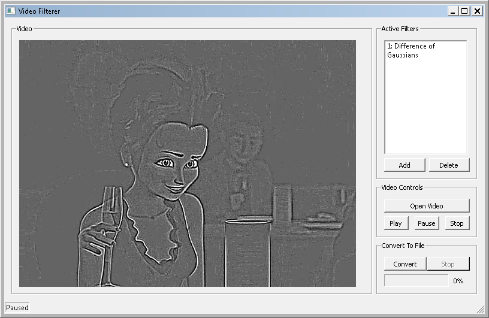
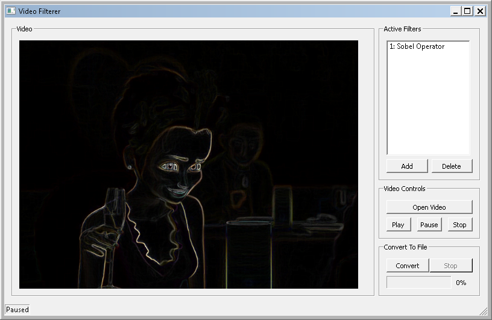
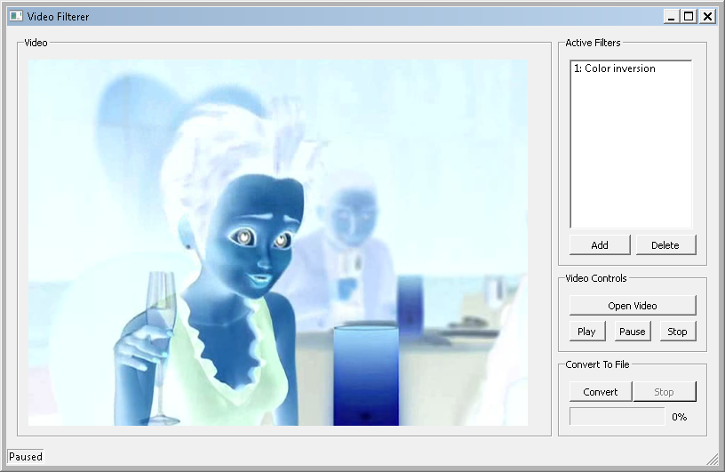

This application is a school project to Multimedia course. It implements several
image and video effects in `OpenCL`, which can be applied to selected file or
interactively previewed in a simple video player.

Available filters/effects are:
- grayscale conversion
- sepia conversion
- color inversion
- generic affine 2D transformation (user has to enter the transformation matrix) 
- 2D convolution (user has to specify the convolution mask)
- 2D separable convolution (for filters that are separable, like gaussian blur)
- Sobel operator
- Embossing 
- Difference of gaussians
- Gaussian blur
- Oilify (an oil painting effect, this is the slowest filter of all)
- Shake (simulates shaking camera)

Other features and highlights:
- every filter is implemented using `OpenCL` and some are also implemented in straight `C++`
- all filters can be easily chained into a linear filter pipeline and thus create
  a new more sophisticated filter, which is not directly implemented in the program
- adding, removing and chaining the filters works in realtime, i.e while playing the video
  (this is achieved via a clever `MVC` design)
- the program uses modified `QOpenCL` library, which allows for very easy `OpenCL` initialization 
  (the original project seems to be dead as of jun 2014, so we had to fix some issues ourselves)
- the program also uses `OpenCV` to load/save and parse video files into frames  

Screenshots:

